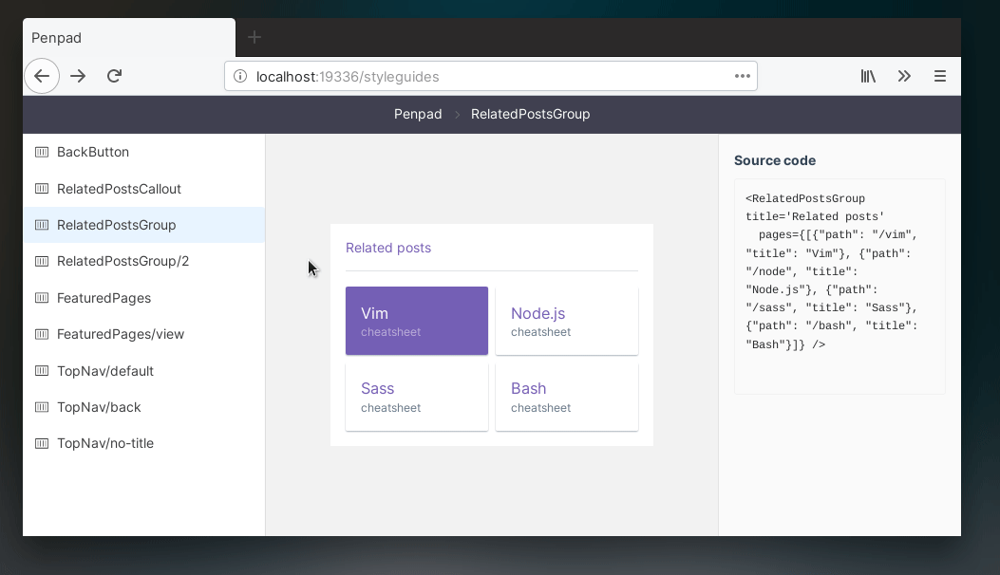

:warning: **NB:** Under heavy development, here be dragons for now :)

---

  

<h1 align='center'>
Penpad
</h1>

Design and document your web UI components

<a href='https://penpad-demo.netlify.com/penpad'><strong>Demo</strong></a>
·
<a href='./docs/index.md'><strong>Documentation</strong></a>

 

Penpad (coming soon) is a tool to design and document your web UI components. Supports React, and everywhere that you can use React&mdash;whether that be Webpack, create-react-app, Gatsby, Next, or anything, really!

- <h3>Write styleguides</h3> Write your styleguides as Markdown
- <h3>Design components</h3> Use Penpad as an isolated scratchpad for writing your React components. Penpad offers a jsbin-like experience by live-reloading your component specimens.
